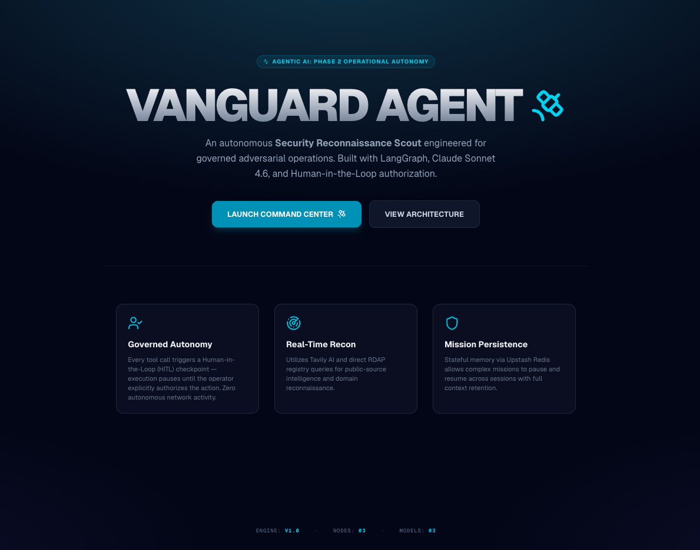
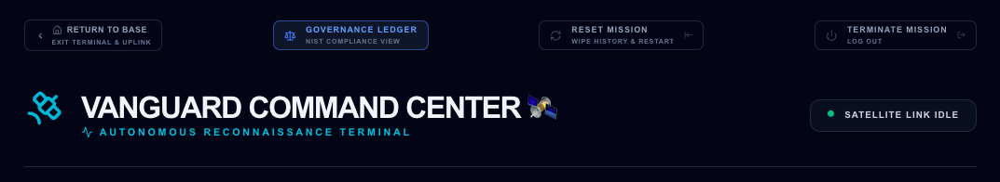
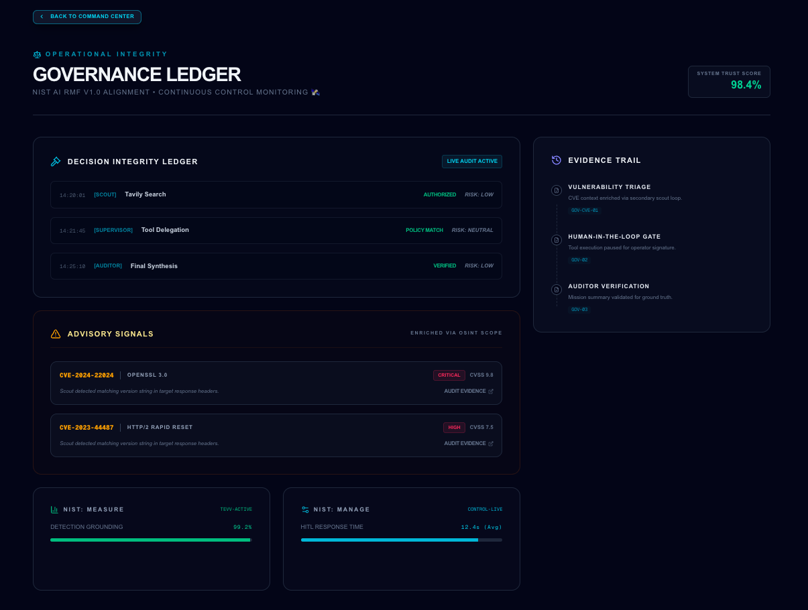
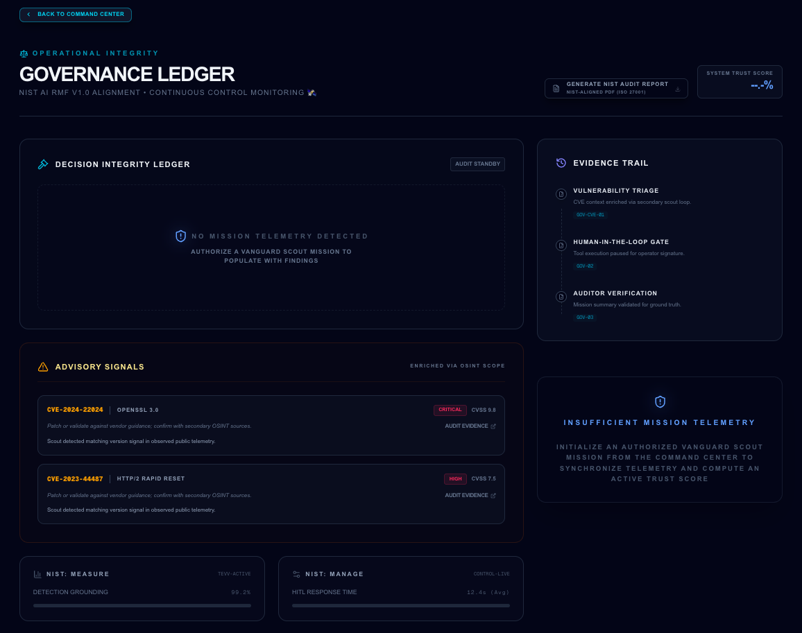
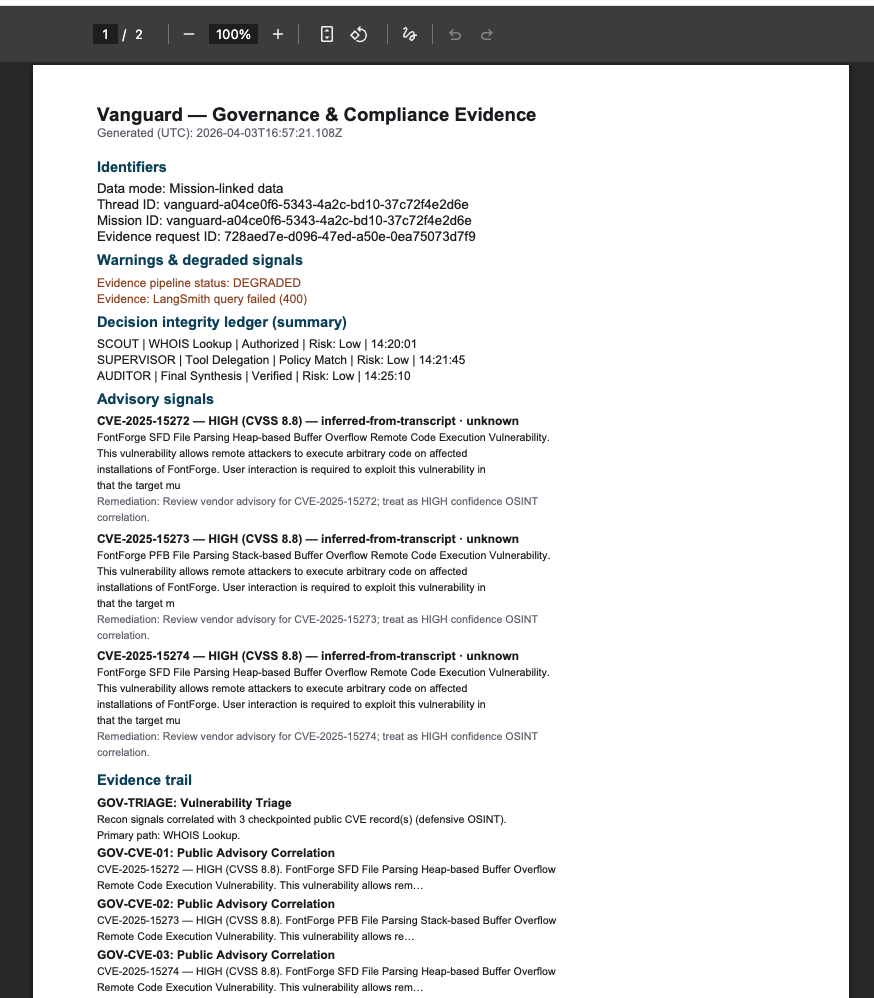

# 🛰️ Vanguard Agent: Autonomous Security Reconnaissance & Governance

**[🚀 View Live Demo](https://vanguard-agent.vercel.app)** | **[📂 View Codebase](https://github.com/GeorgiDS9/vanguard-agent)**

**Agentic AI | Phase 2 Operational Autonomy | Next.js 16 | LangGraph Orchestration | HITL (manual authorization) | NIST-Aligned Governance**

**Vanguard Agent 🛰️** is a proactive **Security Reconnaissance Scout** engineered for governed adversarial operations and independent reconnaissance missions. Unlike standard chatbots that only answer questions, Vanguard is an **autonomous intelligence gatherer** that uses **ReAct (Reason-Action) loops** to explore targets, apply specialized security tools, and deliver mission-critical intelligence through multi-step execution with minimal operator guidance.

Vanguard performs **governed defensive reconnaissance** (**OSINT** - Open-Source Intelligence) on public data sources (e.g., domain/WHOIS/RDAP data, websites and public records, public technical references). It investigates exposure signals and evidence, then produces a **traceable defensive brief**.

Built on the **Phase 2 Operational Autonomy** standard, Vanguard operates with "Governed Execution." It uses **Human-in-the-Loop (HITL)** governance: before external tools run, the agent pauses until you choose **Authorize Mission** or **Abort Action** in the command stream (the **Manual Authorization Required** gate). With **Upstash Redis** persistence and **LangSmith** telemetry, Vanguard provides a stateful, verifiable, and cost-aware workflow for modern security teams.

---

## 🧭 **Engineering Philosophy**

**Vanguard Agent** demonstrates that **Autonomous Agency** does not have to mean a loss of operational control. By applying **Human-in-the-Loop (HITL)** governance and **Stateful Persistence** to the agentic loop, this project provides a blueprint for **Governed AI Systems** that prioritize **Operator Authority**, **Execution Safety**, and **Mission Traceability.**

---

## 🧐 What makes Vanguard an "Agent"?

Here is how Vanguard differs from a standard AI chat:

1. **Independent Planning (The Brain):** You give it a target (e.g., "Find the registrar for google.com"), and the agent decides _how_ to get that info. It doesn't just talk; it plans.
2. **The ReAct Loop (Reasoning + Action):** The agent enters a loop: it **Reasons** ("I need to check the WHOIS records"), takes an **Action** (calls a tool), and then analyzes the result to decide its next move.
3. **Tool Mastery (The Hands):** Vanguard can actually _use_ software. It "plugs in" to services like Tavily (for web search) and RDAP (Registration Data Access Protocol) for domain data to fetch live intelligence that the AI wasn't originally trained on.
4. **Self-Correction:** If a tool call fails or returns messy data, the agent recognizes the error and tries a different approach until the mission is complete.

---

## 📹 Operational Demo

### Full product walkthrough: Command Center Protocol ➔ Scout Recon ➔ Governance Ledger Audit

> [!TIP]
> **Watch Vanguard Agent in Action:** Click the link below to view the high-resolution product demo directly.
>
> **[▶️ Vanguard Agent: Operational Demo Walkthrough](https://github.com/GeorgiDS9/vanguard-agent/releases/download/v0.1.0-demo/vanguard-demo.mp4)**

---

## 🖼️ Vanguard Product Snapshot

### Mission Briefing - _Agentic AI: Phase 2 Operational Autonomy_

> Vanguard Agent Landing Page

## 

### Command Center - _Autonomous Reconnaissance Terminal_

> Vanguard Command Stream - Empty State

## 

> Vanguard Command Stream - Mission Timeline

## 

> Vanguard Command Stream - Authorization Step

## 

> Vanguard Command Stream - Rehydrated Session

## 

### Governance Ledger - _NIST AI RMF v1.0 Governance Report: Automated Audit Trail & Integrity Score_

> Navigate from Command Centre to Governance Ledger

## 

> Vanguard Governance Ledger - Available Mission Data

## 

> Vanguard Governance Ledger - No Mission Data

## 

> Vanguard Governance Ledger - Mission Evidence & Compliance Report Example (Generated PDF)

## 

---

## 🛰️ What Vanguard Does

Vanguard is a governed autonomous reconnaissance system for defensive security operations.  
Its job is not just to answer prompts, but to execute a mission lifecycle with explicit control points and traceable decisions.

At runtime, Vanguard:

- **Accepts a mission objective** from the operator (target + defensive intent).
- **Plans reconnaissance steps** through a multi-agent flow (Supervisor, Scout, Auditor).
- **Prepares context-bound actions** (tool, args preview, purpose, risk/side-effects, expiry).
- **Enforces Human-in-the-Loop governance** before external tool execution.
- **Executes approved reconnaissance actions** against public-source intelligence channels.
- **Correlates and summarizes evidence** into an operator-readable defensive brief.
- **Maintains mission state and decision history** for replay, auditing, and governance evidence.
- **Applies guardrails** (approval binding, stale/replay protection, rate limits, policy checks).

In practical terms, Vanguard converts “run recon on this target” into a controlled, auditable mission workflow where operator authority is preserved at the action boundary.

---

## 🧾 What Vanguard Produces

Vanguard produces more than chat text.  
Each mission is intended to end with decision-grade defensive intelligence and governance artifacts.

Typical mission output includes:

### 1) Mission Context and Scope

- Target context used for the mission
- Stated objective and bounded defensive intent
- Operator-visible execution framing (what Vanguard is trying to validate)

### 2) Evidence-Backed Findings

- Public-source reconnaissance results (e.g., WHOIS/RDAP + corroborating web intelligence)
- Key observations distilled into concise, actionable findings
- Confidence annotations to help triage follow-up priorities

### 3) Governance and Authorization Trail

- What action was requested for authorization
- Which context was approved/aborted
- Approval freshness/integrity controls applied
- Decision outcomes suitable for audit review

### 4) Defensive Next Steps

- Safe follow-up actions for security/engineering teams
- Suggested validation paths when confidence is medium/low
- Clear indication of what was _not_ executed (if mission was aborted or constrained)

### 5) Export-Ready Evidence Foundation

- Structured mission and governance records that can feed compliance artifacts
- Trace-linked data suitable for downstream reporting (JSON evidence export and **NIST-aligned governance PDF** from `/governance`)

In short, Vanguard’s output is designed to support operational decisions, team handoffs, and compliance narratives from the same mission run.

---

## 🧭 How to Use Vanguard Output

Vanguard output is most valuable when treated as an operational decision aid, not a final truth artifact by itself.  
Use it to accelerate secure triage while preserving verification discipline.

### A) Immediate Operator Workflow

After each mission, use the output to:

1. **Confirm target and scope alignment**  
   Verify the brief matches the intended target and mission objective.

2. **Review confidence and evidence quality**  
   Distinguish high-confidence findings from leads that need secondary validation.

3. **Prioritize response actions**  
   Convert findings into practical next steps for security or engineering teams.

4. **Record governance context**  
   Retain who approved what, when, and under which mission conditions.

### B) Team Handoff Workflow

Use Vanguard briefs to hand off work across functions:

- **Security analysts:** start investigation with structured findings and references.
- **Engineers/platform teams:** act on concrete remediation follow-ups.
- **Leadership/compliance stakeholders:** review traceable decision history and control posture.

This reduces rework and improves consistency because mission context, findings, and governance decisions are already packaged together.

### C) Compliance and Audit Workflow

For governance-heavy environments, treat Vanguard output as evidence input:

- Map mission actions to your internal control model.
- Attach approval/decision records to change or incident tickets.
- Use trace-linked outputs to support periodic governance reviews.
- Build toward formalized reporting exports (JSON baseline now, PDF/reporting expansion next).

### D) Good Usage Practices

To get reliable value:

- Use one clear objective per mission.
- Keep requests defensive and bounded.
- Treat medium/low-confidence findings as investigation leads, not conclusions.
- Preserve governance logs alongside technical findings.

### E) What Vanguard Is Not

Vanguard is not intended as an autonomous offensive executor.  
Its purpose is governed defensive reconnaissance with operator authority and auditable decision flow at the center.

---

## 🎯 How to Engage Vanguard

Use clear, target-specific defensive requests.  
Best results come from one mission objective per prompt.

**Examples:**

- “Run a defensive OSINT reconnaissance on `openai.com`: collect registrar/domain ownership signals, recent public security mentions, and summarize with confidence + safe next actions.”
- “Assess `example.com` for public exposure indicators: WHOIS/RDAP ownership context, subdomain-related public references, and potential defensive follow-ups.”
- “Run defensive OSINT only. After domain_whois and tavily_search, briefly list any publicly disclosed CVE IDs that are relevant to technologies or versions you infer from open sources (cite IDs like CVE-2024-1234 only if they appear in public references you find). Do not exploit anything.”

✅ **Operator note:** If Vanguard requests authorization, review the approval context (tool, args, risk, side effects) before selecting **Authorize Mission** or **Abort Action**.

### 🔐 Demo Access (Recruiter Testing)

Use the live demo credentials below to test the full Command Center flow:

- **Login URL:** `https://vanguard-agent.vercel.app/login`
- **Username:** `demo`
- **Password:** `RqrEBqs0C8J_nTFvBrRu-jAboMsOJC`

> Demo access is provided for evaluation and portfolio review only. Demo credentials are rotated periodically.
>
> Rate limit is 5 missions per rolling minute and 5 per rolling hour per client IP.

---

> [!TIP]
> **Mission Strategy:** For deeper technical context, see [ARCHITECTURE_FLOWS.md](./docs/ARCHITECTURE_FLOWS.md) for runtime flow diagrams.
> For planned hardening work, intentional deferrals, and 7-skill maturity sequencing, see [HARDENING_ROADMAP.md](./docs/HARDENING_ROADMAP.md).
> For adversarial test outcomes and evidence posture, see [SECURITY_ADVISORY.md](./docs/SECURITY_ADVISORY.md). _This document is maintained locally and intentionally not published to prevent detailed red-teaming methodology from being publicly available._

---

## 🏗️ Core Agentic Architecture

- **Supervisor-Worker Pattern:** Implements a dual-node hierarchy where a **Supervisor (The General)** plans the mission and a **Scout (The Worker)** executes specialized reconnaissance tasks.
- **Approval-Gated Execution (HITL):** Tool execution is paused until operator authorization, with approval/abort events captured in mission state and UI.
- **Edge-Native Reconnaissance:** Optimized for the **Vercel Edge Runtime**, providing globally distributed, low-latency intelligence gathering.
- **Satellite Intelligence (Tavily):** Integration with Tavily AI for real-time, AI-optimized web search to identify live threat indicators and CVE data.
- **Direct Registry Access (RDAP):** Specialized tools for direct domain reconnaissance, querying global registries for registrar data and registration events.
- **Mission Persistence:** Powered by **Upstash Redis**, allowing complex reconnaissance missions to "sleep" and "wake" across sessions with 100% context retention.
- **Economic Shield (Circuit Breaker):** A state-managed `iterationCount` that auto-terminates the agent after 10 loops to prevent "Hallucination Spirals" and budget drain.
- **Stateful Mission Log:** Utilizes **LangGraph** message reducers to maintain an immutable history of reasoning, tool calls, and operator approvals.
- **Observability as Evidence:** Full integration with **LangSmith** to provide a verifiable audit trail of the agent's "Internal Monologue" and tool outputs.
- **Grounded Command UI:** A high-contrast, tactical dashboard designed for high-pressure security environments, featuring real-time streaming of reasoning steps.
- **Streaming chat (Vercel AI SDK):** Dashboard uses the **`ai`** runtime and **`@ai-sdk/react`** (`useChat`, transport) with **`@ai-sdk/langchain`** to stream LangGraph events to the UI over `/api/chat`.
- **Schema-Based Intelligence:** Uses **Zod v4** for strict data contracts, ensuring all tool outputs are validated before being ingested into the agent's memory.
- **Multi-Model Configuration:** Leverages **Claude Sonnet 4.6** for primary reasoning and **GPT-4o-mini** for secondary mission auditing and final reports.
- **Operator identity & RBAC:** Authenticated operators with **roles** (e.g. who may deploy missions, authorize tools, or view audit trails), enforced at the UI and API layers alongside HITL.

---

## 🛠️ Tech Stack

- **Frontend:** Next.js 16 (App Router), Tailwind CSS 4, Lucide Icons (Tactical Set) — **Command Center** at `/dashboard`, **Governance Ledger** (NIST-aligned shell) at `/governance`.
- **Vercel AI SDK:** **`ai`**, **`@ai-sdk/react`**, **`@ai-sdk/langchain`** — streaming UI messages, chat transport, and LangGraph → UI message stream bridging for `/dashboard`.
- **Agentic Brain:** Anthropic Claude Sonnet 4.6 (Primary Scout)
- **Autonomous Auditor:** OpenAI GPT-4o-mini (The Judge)
- **Logic Engine:** LangGraph.js (State Machine Orchestration)
- **Mission Persistence:** Upstash Redis (HTTP-based State Checkpointing)
- **Intelligence Vault:** Upstash Vector (CVE & Recon Knowledge Storage)
- **Reconnaissance Uplink:** Tavily AI (Agentic Web Search)
- **Observability:** LangSmith (Telemetry & Trace Partitioning) · Sentry (Error Monitoring — client, server, Edge Runtime)
- **Validation:** Zod 4 (Strict Data Contracts)
- **Runtime:** Vercel Edge Functions (Distributed Compute)
- **Testing:** **Vitest** (unit tests: Zod request contracts, mission/approval state, dashboard message utilities) · **Playwright** (dashboard e2e smoke: shell UI, empty state, mocked chat errors)
- **MCP:** **vanguard-mcp-server** (stdio; `vanguard_ping`, `domain_whois` via shared RDAP helper)
- **Auth & access:** HTTP-only JWT session (`__Host-vanguard-session`) signed with `jose`; **RBAC** with `viewer / analyst / admin` roles enforced at proxy layer and API routes.

---

## 🔌 MCP Server Architecture

Vanguard ships a **standalone MCP server** (`mcp-server/`) in addition to its in-process LangGraph tooling. The two are different surfaces serving different consumers.

### Why a separate package?

The MCP server runs as a **stdio subprocess** — launched by an MCP client (Claude Code, Claude Desktop, Cursor) via its config file. That transport requires process-level `stdin`/`stdout`, which a Next.js HTTP server cannot provide. The separate `package.json` under `mcp-server/` isolates its own `tsx`, `typescript`, and `@modelcontextprotocol/sdk` dependencies from the main app build.

### What it exposes

The server registers two tools over the MCP protocol:

| Tool            | Description                                                                  |
| :-------------- | :--------------------------------------------------------------------------- |
| `vanguard_ping` | Health check — no side effects                                               |
| `domain_whois`  | Public RDAP domain summary — same logic as the LangGraph `domain_whois` tool |

`domain_whois` reuses `src/lib/recon/rdapDomainSummary.ts` directly — the logic is shared, not duplicated.

### How this differs from an in-process tool layer

A project whose tools exist solely to serve its own agent (e.g. an internal `registry.ts` → typed client pattern) has no need for a standalone MCP server. Vanguard adds one because the same recon capability is useful to **external operator tooling** — an IDE, a local Claude client, or any other MCP-aware surface — independent of running a full mission.

```
External MCP client (Claude Code / Claude Desktop / Cursor)
        ↓  stdio  (MCP protocol)
  mcp-server/src/index.ts   ←  McpServer (vanguard_ping, domain_whois)
        ↓
  src/lib/recon/rdapDomainSummary.ts   ←  shared with LangGraph Scout
```

The in-process LangGraph tools remain the authoritative execution path for missions; the MCP server is a read-only operator surface on top of the same primitives.

---

## 🔒 CVE scope, advisories & governance honesty (v1)

This project uses a **narrow, documented** defensive posture — not generic product-wide CVE discovery.

**In scope for v1**

- **Defensive OSINT:** Reconnaissance and correlation from **public** sources (e.g. WHOIS/RDAP, web search) under HITL and policy.
- **CVE correlation:** When a **CVE identifier** appears in **mission artifacts** (e.g. assistant/tool text, checkpointed state), findings are normalized, **NVD-backed**, budgeted, and checkpointed; they flow into **governance** (dashboard + **PDF export**).

**Explicitly not in v1**

- **Standalone CPE / stack keyword enrichment** that invents lookups **without** a CVE string in scope (no “silent” keyword NVD search path).
- **Multi-provider primary advisory fetch** beyond **NVD** as the catalog for correlated CVE rows.
- **Full SCA** or “find every vulnerability in my stack” automation — out of scope for this codebase’s stated mission.

**System Trust Score** (Governance header): With **mission-linked** data (`source === "derived"` in code), the headline blends **NIST Measure** and **NIST Manage**, with penalties for degraded evidence, warnings, and advisory overflow. In **standby** (insufficient transcript / no populated integrity ledger), the score shows a dimmed **`--.-%`** placeholder; a **System Status: Standby** brief under Evidence Trail explains that an **authorized Command Center** mission is needed to calibrate scores and the ledger.

**NIST Manage (card):** Reflects **HITL gate resolution** (authorized / aborted / pending). When trace or advisory posture is stressed (degraded evidence, enrichment warnings, overflow), the card applies **small documented penalties** to the percent and may adjust the label to **“Gate + oversight posture.”**

---

## 🚀 Project Roadmap

- [x] **The Core Setup:** Implemented a LangGraph-based agent loop with stateful control flow.
- [x] **Satellite Vision:** Integrated Tavily AI for real-time public web intelligence.
- [x] **Approval Gate (HITL):** Implemented operator authorization flow before external tool execution.
- [x] **Persistence & Reliability:** Upstash Redis-backed checkpointing enables state recovery and multi-session mission continuity.
- [x] **Command Center UI:** Streaming mission interface with approval context and operator controls.
- [x] **Grounded Alignment:** Synchronized Home and Dashboard visuals to the Phase 2 standard.
- [x] **Supervisor Refactor:** General/Scout/Auditor hierarchy implemented; routing and approval UX aligned with Phase 2 Command Center (iterative polish as needed).
- [x] **Automated Unit Testing:** **Vitest** for API request validation (Zod), mission and approval state helpers, and dashboard message utilities.
- [x] **CI/CD and e2e Validation:** **GitHub Actions** enforces lint, unit tests (with coverage), and production build on pushes/PRs to `main`, plus **Playwright** Chromium smoke checks for core dashboard behavior (shell controls, initial feed state, mocked `/api/chat` failure paths). Live HITL/API scenarios remain opt-in behind `E2E_LIVE`.
- [x] **MCP server (stdio):** `mcp-server/` with **`vanguard_ping`** and **`domain_whois`** (RDAP, shared with LangGraph). Expand with **`nmap`** or other tools under explicit policy later.
- [x] **Vercel deployment:** Production app hosted on **Vercel**; API keys and service credentials are set as **server-side environment variables** in the Vercel project (not committed to the repo).
- [x] **Adversarial Red-Teaming:** Stress-testing the authorization gate against jailbreak attempts.
- [x] **Auth & RBAC:** Operator authentication (sessions / identity provider) and **role-based access control** for dashboard routes, mission actions (e.g. deploy, approve tools), and audit-sensitive APIs.
- [x] **Operational & Governance Docs:** Runbook, security advisory, and architecture flow documentation.
- [x] **Demo Access (Recruiter-Friendly):** Add a rotating `demo_admin` account and document public demo access workflow.
- [x] **Mission Timeline & Replay (Command Center UI):** Compact event timeline with read-only playback.
- [x] **Compliance Evidence Export (PDF):** Generate downloadable audit reports from trace-linked mission evidence (LangSmith + governance logs).
- [x] **NIST-Aligned Governance Dashboard:** Decision integrity ledger, mission timeline replay, and traceable control evidence mapped to AI risk management and compliance oversight (`/governance`).
- [x] **Dependency & audit hygiene:** `npm audit --audit-level=high` on **root** and **`mcp-server/`** in CI; policy in [`docs/dependency-audit-policy.md`](./docs/dependency-audit-policy.md); one-line register [`docs/dependency-risk-register.md`](./docs/dependency-risk-register.md).
- [x] **Defensive CVE / advisory correlation (v1 documented):** Narrow scope — CVE IDs from **mission artifacts** → **NVD** correlation with existing budgets, checkpointing, governance UI + PDF; **not** standalone keyword/CPE enrichment without a CVE string, **not** multi-provider primary fetch beyond NVD, **not** full SCA (see section above).
- [x] **Error Boundaries:** Integrated "Circuit Breakers" to prevent app-wide crashes and allow one-click recovery in order to maintain operational telemetry during runtime exceptions.
- [x] **Error Monitoring (Sentry):** `@sentry/nextjs` wired across client, server, and Edge Runtime. Unhandled exceptions are captured and reported automatically; a `global-error` root boundary surfaces reset UI while reporting to Sentry.
- [ ] **Auth: evaluate / migrate to Clerk (optional):** Replace custom session flow with Clerk if product direction confirms; preserve roles, `/dashboard` access, root `proxy` (auth/RBAC), and Playwright e2e bypass or Clerk test mode.

---

## ✅ Operational Validation

Vanguard is validated across autonomous reasoning, tool accuracy, and governance resilience.

- **Autonomous Scout Test:** "Analyze the domain `vanguard-security.com` and find its registrar data."
  - **Expect:** Agent suggests `domain_whois`, pauses for approval, and returns structured RDAP data.
- **Economic Shield Test:** "Find every single person mentioned on the internet with the name John."
  - **Expect:** Agent initiates search but is terminated by the **Circuit Breaker** after 10 loops to protect the budget.
- **Governance Resilience:** Attempt to bypass the "Authorize Mission" button via console injection.
  - **Expect:** LangGraph state remains locked at the breakpoint until a signed API signal is received.

---

## ⚡ Red-Team Validation

See [`docs/SECURITY_ADVISORY.md`](./docs/SECURITY_ADVISORY.md) for adversarial test scenarios, observed defenses, and evidence posture. _This document is maintained locally and intentionally not published to prevent detailed red-teaming methodology from being publicly available._

---

## 🚦 Getting Started

Follow this four-stage protocol to initialize the Vanguard Agent environment and verify its autonomous reconnaissance layers.

1.  **Environment Initialization:**

```bash
git clone https://github.com/GeorgiDS9/vanguard-agent
cd vanguard-agent
npm install
```

2.  **Infrastructure Configuration (.env.local):**

```bash
# 🧠 Primary Satellite Brain (Anthropic Claude 4.6)

# Powers the core Agentic Reasoning and Tool-Calling logic.

ANTHROPIC_API_KEY=sk-ant-api03-xxxx...

# ⚖️ Autonomous Auditor (OpenAI GPT-4o-Mini)

# Provides secondary semantic validation and final mission reports.

OPENAI_API_KEY=sk-proj-xxxx...

# 📡 Reconnaissance Intelligence (Tavily AI Scout)

# The search engine built for AI Agents (Agentic Scout).

TAVILY_API_KEY=tvly-xxxx...

# 🗄️ Persistent Vector Vault (Upstash Vector)

# Stores reconnaissance results and CVE data for semantic retrieval.

UPSTASH_VECTOR_REST_URL=https://...
UPSTASH_VECTOR_REST_TOKEN=...

# 🛡️ Economic Shield & Persistence (Upstash Redis)

# Manages rate-limiting (per client IP: 5 missions per rolling minute and 5 per rolling hour on POST /api/chat, plus approval limits) and stateful LangGraph mission checkpoints.

UPSTASH_REDIS_REST_URL=https://...
UPSTASH_REDIS_REST_TOKEN=...

# 📊 Mission Observability (LangSmith)

# Tracks agent reasoning loops, tool-calls, and audit traces.

LANGSMITH_TRACING=true
LANGCHAIN_TRACING_V2=true

# EU Endpoint (eu-west)

LANGSMITH_ENDPOINT=https://eu.api.smith.langchain.com
LANGSMITH_API_KEY=lsv2_pt_xxxx...
LANGSMITH_PROJECT=vanguard-agent-recon

# Ensures the trace completes before Next.js Edge function termination

LANGCHAIN_CALLBACKS_BACKGROUND=false

# 🚨 Error Monitoring (Sentry)

# Captures unhandled exceptions across client, server, and Edge Runtime.

NEXT_PUBLIC_SENTRY_DSN=https://xxxx@xxxx.ingest.sentry.io/xxxx

```

3.  **Development & Security Audit:**

Launch the Autonomous Reconnaissance Terminal (Next.js 16 / Turbopack):

```bash
npm run dev
```

4.  **Automated security audits (Vitest + Playwright):**

Vanguard uses **Vitest** for fast unit tests over dashboard helpers, chat request validation, and related logic, and **Playwright** for browser checks on `/dashboard` (including mocked API failure paths). **GitHub Actions** runs lint, unit tests with coverage, production build, and e2e on pushes and pull requests to `main`.

**Unit tests (Vitest)**

```bash
npm run test              # single run
npm run test:watch        # watch mode
npm run test:coverage     # coverage report → coverage/ (HTML + JSON)
```

**End-to-end (Playwright)**

Install browsers once (or after upgrading @playwright/test):

```bash
npx playwright install
```

Then:

```bash
npm run e2e               # local: all projects (Chromium, Firefox, WebKit); starts dev server via config
npm run e2e:ui            # interactive UI mode
```

For a quicker local run (Chromium only):

```bash
npx playwright test --project=chromium
```

**MCP server (stdio)**

First-time setup: `cd mcp-server && npm install`. From the repo root:

```bash
npm run mcp
```

Runs `vanguard-mcp-server` over stdio for Cursor / Claude Desktop–style clients. Tools: **`vanguard_ping`** (no side effects) and **`domain_whois`** (public RDAP, same logic as `src/lib/recon/rdapDomainSummary.ts`).

**HITL live scenario (optional):** skipped in CI unless you set `E2E_LIVE=1` and supply the keys in `.env.local` required by that test.

---

### Production (Vercel)

The live demo is deployed on **Vercel**. Configure the same variables as in `.env.local` in the project’s **Settings → Environment Variables** (Production / Preview as needed), then redeploy. Do not expose provider keys in client-side code.

---

## ⬢ What’s Next: Aegis Node

Vanguard is Phase 2 of a larger protocol. **Phase 3 is Aegis Node** — the autonomous remediation counterpart built to act on the intelligence Vanguard produces.

### The Vanguard Protocol

Vanguard is not a standalone tool — it is the intelligence layer of a two-part system. The **Vanguard Protocol** is the output contract: structured reconnaissance findings, approval records, and trace-linked evidence that a downstream remediation system can act on directly. Aegis is the first system built to consume that protocol.

### What Aegis Node Does

While Vanguard provides **passive observation and governed reconnaissance**, Aegis executes **autonomous remediation and perimeter hardening at the edge.** It turns Vanguard’s intelligence into automated threat neutralization through:

- **Real-time patching** triggered by Vanguard-correlated CVE findings
- **Adaptive WAF rules** derived from reconnaissance exposure signals
- **Self-healing infrastructure** — automated rollback and recovery workflows
- **Kernel-level enforcement** on Apple Silicon (M4) — extending protection from the cloud perimeter down to edge hardware and distributed systems

Aegis is the **authorized remediation node for the local Mac-Silicon (M4) perimeter** within the Vanguard Protocol. Where Vanguard reports, Aegis acts — under the same HITL governance model, extended to active response.

### Protocol Flow

```
Vanguard (Intelligence Grid)
  → HITL-authorized reconnaissance
  → Trace-linked, NIST-aligned findings + CVE correlation
  → Vanguard Protocol output (machine-readable, signed)
        ↓
Aegis Node (Remediation Engine)
  → Receives protocol output as authorized mission context
  → Executes real-time patching, WAF hardening, self-healing
  → Enforces perimeter policy at Apple Silicon (M4) edge
```

**Aegis Node** is currently in active development as a standalone platform (Next.js 15 · Ollama Llama-3 · macOS Native Enforcement · Unified Memory Optimized for M4). The Vanguard Protocol defined in this codebase is the intelligence layer it consumes.

---
