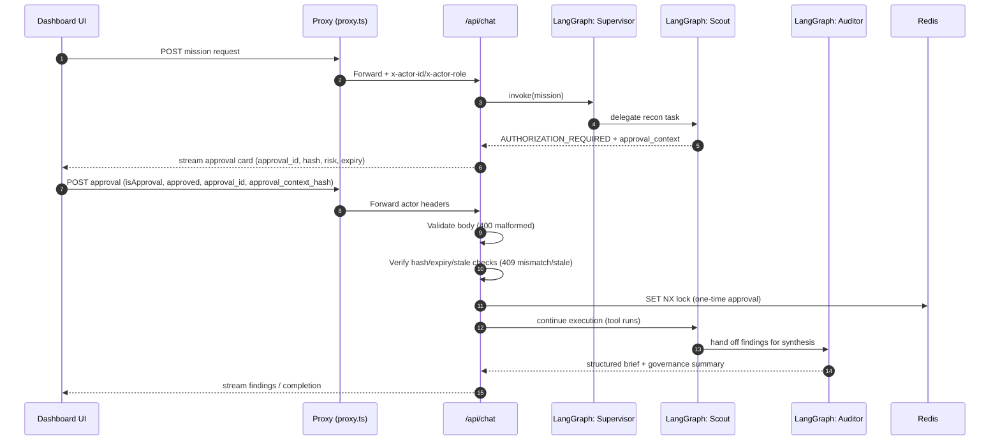
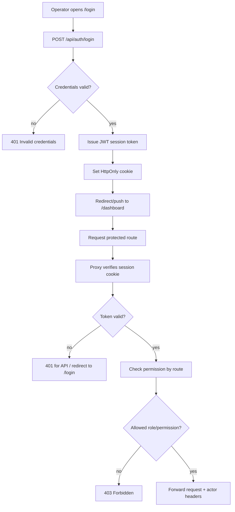
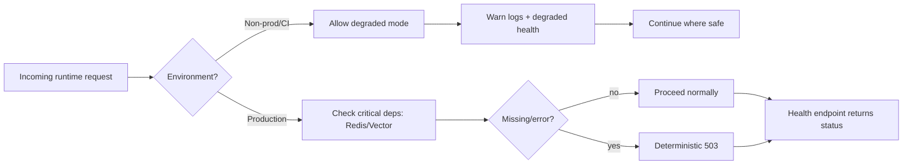
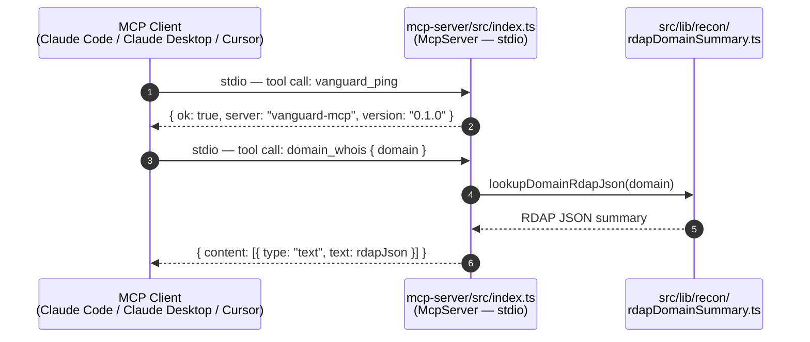

# 🛰️🏛️ Vanguard Architecture Flows

This document captures the core runtime flows that define Vanguard’s current behavior:

- Human-in-the-Loop (HITL) governance and anti-tamper controls
- Authentication and RBAC enforcement
- Runtime dependency strictness (degraded vs fail-closed behavior)
- MCP server — external operator tooling surface (stdio)

Use this file as the engineering source of truth for flow-level behavior.  
When implementation changes, update this doc in the same PR.

---

## How to Read These Diagrams

- **UI** = operator-facing dashboard and login pages.
- **Proxy** (root `proxy.ts`, formerly “middleware”) = request gate for auth + permissions.
- **/api/chat** = mission orchestration and HITL enforcement.
- **LangGraph** = agent decision/flow execution engine.
- **Redis** = lock/state/persistence substrate for mission safety controls.
- **MCP Server** = standalone stdio subprocess exposing read-only operator tools to external MCP clients.

Status code conventions used across flows:

- `400` malformed request payload
- `401` unauthenticated
- `403` authenticated but unauthorized
- `409` stale/tampered/replay approval conflict
- `429` rate-limited
- `503` critical runtime dependency unavailable (production strict mode)

---

## 1) HITL Approval + Anti-Tamper Flow

### Why this exists

Vanguard is designed for governed execution.  
No external action should proceed through the approval path unless the operator is approving the **exact** context currently pending.

### What the operator should understand

When the dashboard asks for authorization, the action is bound to a specific approval context (`approval_id` + hash + freshness window).  
Approving stale or modified payloads is intentionally rejected.

### What this flow guarantees

- Approval requests are validated before execution.
- Tampered or stale approvals are blocked deterministically.
- Replay is blocked via one-time lock semantics.
- Mission continues only after policy/guard checks pass.

### Diagram



---

## 2) Auth + RBAC Request Flow

### Why this exists

Vanguard separates identity from capability:

- Identity is established at login.
- Capability is enforced per route with permissions.

### What the operator should understand

A valid session alone is not enough for every action.  
Role/permission controls decide whether the request can proceed to sensitive routes (mission execution, audit export, etc.).

### What this flow guarantees

- Unauthenticated users are redirected/blocked.
- Unauthorized users receive deterministic `403`.
- Authorized requests pass with actor identity headers for downstream audit linkage.

### Diagram



---

## 3) Runtime Strictness Policy (Health + Dependencies)

### Why this exists

Vanguard must remain developer-friendly in non-production while being strict and predictable in production.

### What the operator should understand

Behavior differs by environment intentionally:

- Non-prod/CI can degrade to support iteration and test startup.
- Production fails closed for critical dependency outages.

### What this flow guarantees

- No silent production drift when critical infra is missing.
- Consistent health semantics and deterministic failure behavior.
- Clear operational signal for incident triage.

### Diagram



---

## 4) MCP Server — External Operator Tool Surface

### Why this exists

Vanguard's LangGraph tools exist to serve the in-process agent. The MCP server exists to serve **external MCP clients** — Claude Code, Claude Desktop, Cursor, or any IDE that speaks the MCP protocol. It surfaces the same read-only recon primitive (`domain_whois`) through a second transport without duplicating the underlying logic.

### What the operator should understand

The MCP server is a **stdio subprocess**, not an HTTP service. An MCP client launches it via its config file and communicates over `stdin`/`stdout` using the MCP protocol. It has no auth layer — only read-only, no-side-effect tools are registered. It does not connect to Redis, the LangGraph state machine, or any mission execution path.

### What this flow guarantees

- Tool calls from external MCP clients never touch mission state or the approval gate.
- `domain_whois` logic is shared with the LangGraph Scout — one implementation, two transport surfaces.
- Any tool not explicitly registered in `mcp-server/src/index.ts` is unreachable by MCP clients.

### Diagram



### Relationship to in-process LangGraph tools

```
Mission execution path (in-process)          External operator tooling (stdio)
─────────────────────────────────────        ──────────────────────────────────
LangGraph Scout node                         MCP Client (Claude Code / Desktop)
       ↓                                              ↓  stdio
  src/lib/agent/tools.ts (domain_whois)       mcp-server/src/index.ts
       ↓                                              ↓
  src/lib/recon/rdapDomainSummary.ts  ←───── shared ─┘
```

The shared helper is the source of truth. The MCP server adds a read-only operator surface on top; it does not replace or bypass the in-process tool layer.

---

## Update Rules (Keep This Accurate)

Update this document whenever any of the following changes:

- Approval contract fields or approval validation order
- Route permission model or protected route set
- Dependency strictness policy or health endpoint semantics
- Actor header propagation behavior
- MCP tool registrations, transport, or shared recon helpers

If a code change alters runtime behavior but this doc is not updated, treat that as an incomplete PR.

---

## Suggested Companion Docs

- `docs/OPERATIONS_RUNBOOK.md` for incident handling and operational procedures
- `README.md` for high-level product narrative
- (Optional) `docs/WHITEPAPER.md` for external architecture narrative snapshots
